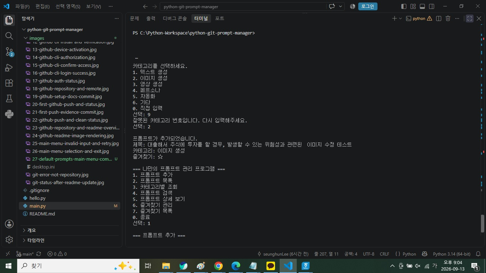
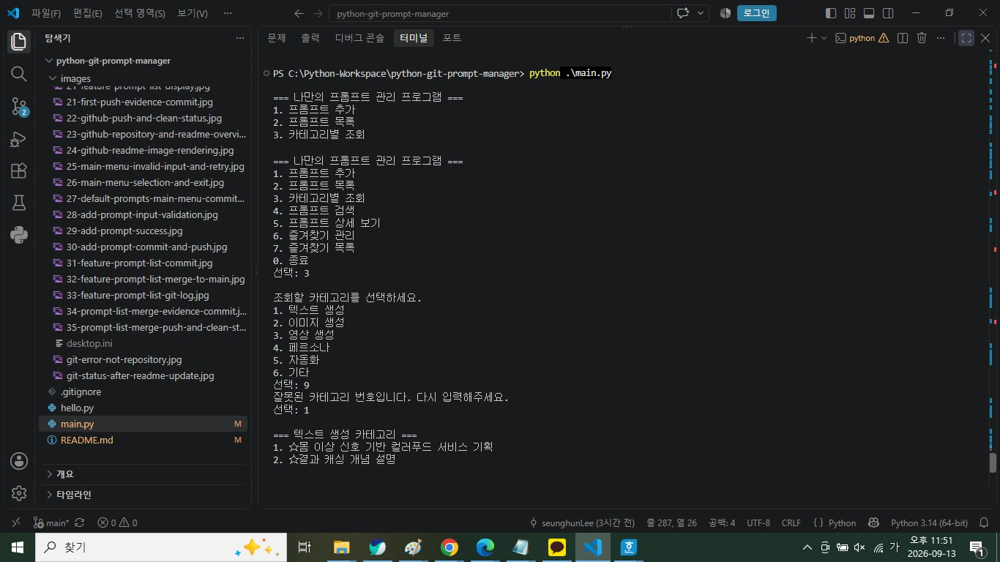
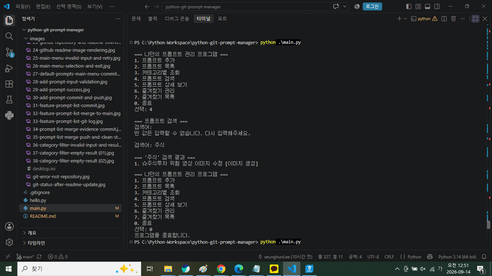
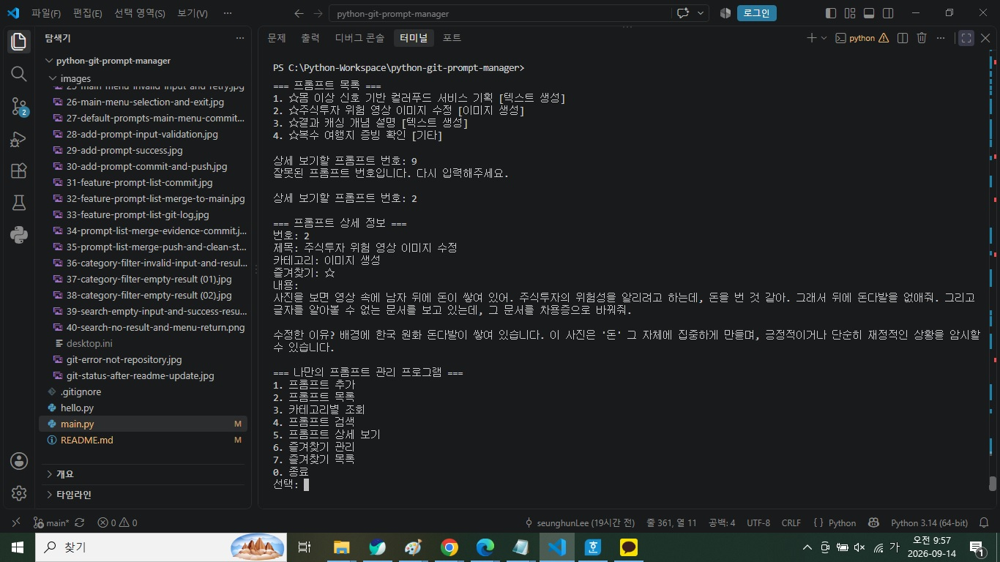
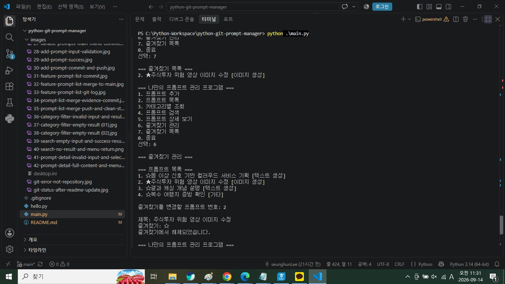
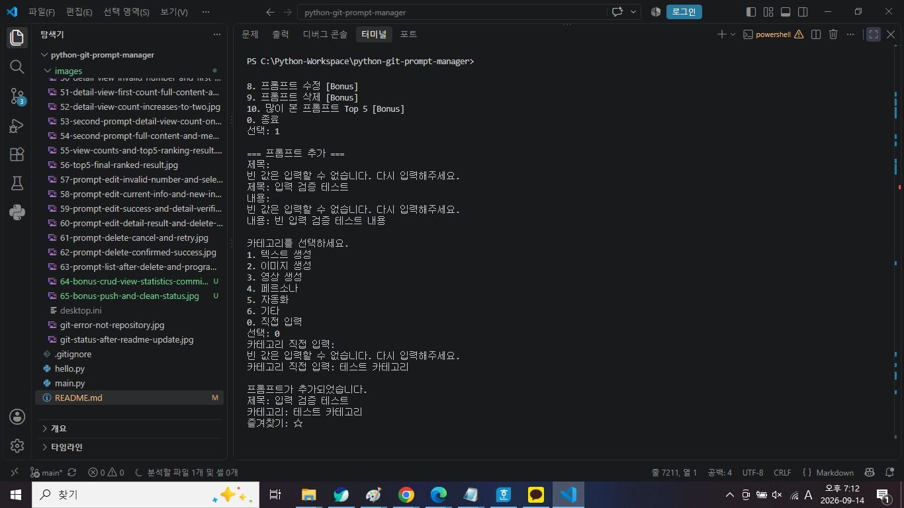
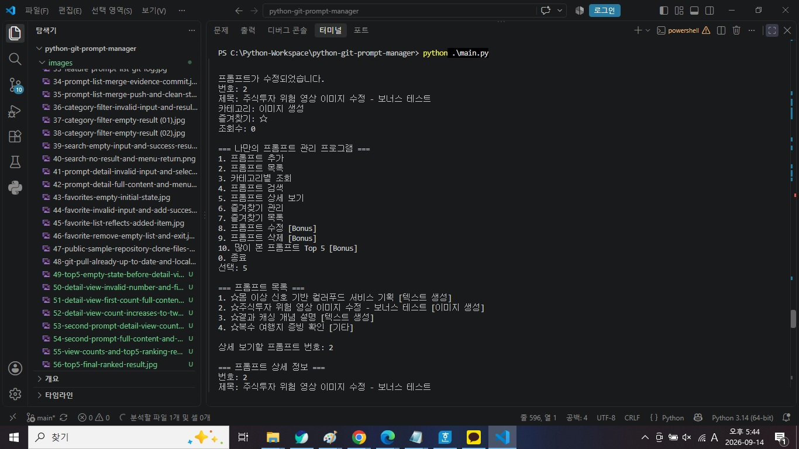
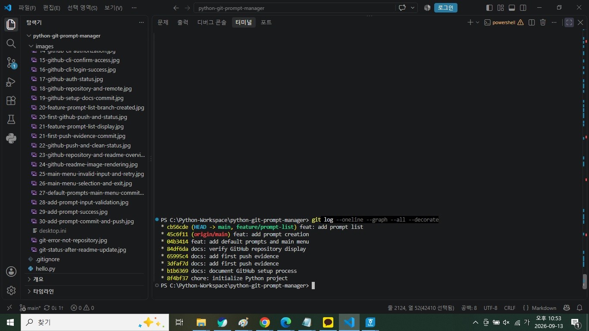
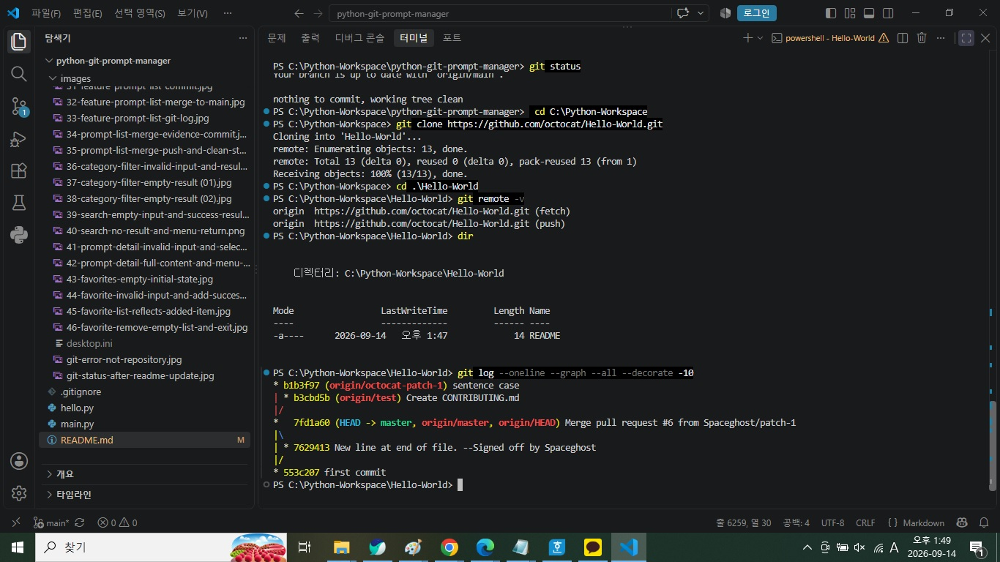
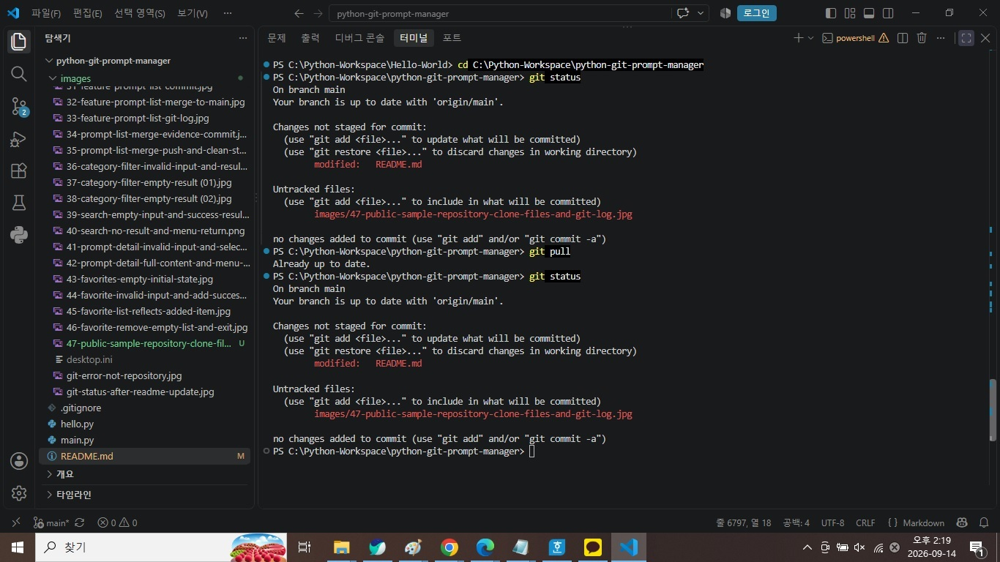

# Python & Git 기초 — 나만의 프롬프트 관리 프로그램

## 1. 프로젝트 소개

이 프로젝트는 Python 기초 문법과 Git/GitHub 사용법을 익히기 위해 제작한 **콘솔 기반 프롬프트 관리 프로그램**입니다.

이전 AI 미션에서 작성한 프롬프트를 기본 데이터로 등록하고, 사용자가 새로운 프롬프트를 추가하거나 카테고리별 조회, 검색, 상세 보기, 즐겨찾기 기능을 사용할 수 있도록 구현했습니다. 또한 기능 단위로 Git Commit을 남기고, 별도 Branch에서 기능을 개발한 뒤 `main` Branch에 Merge하는 과정을 실제로 수행했습니다.

**GitHub Repository**

https://github.com/lsh97nd-code/python-git-prompt-manager

---

## 2. 과제 요구사항 요약

과제에서 요구하는 핵심 산출물은 다음과 같습니다.

- Python 콘솔 기반 프롬프트 관리 프로그램
- 이전 미션 프롬프트 기본 데이터 3개 이상
- 프롬프트 추가, 목록, 카테고리별 조회, 검색, 상세 보기, 즐겨찾기
- 프로그램 실행 중 추가 데이터와 즐겨찾기 상태 유지, 종료 시 초기화
- List + Dictionary 사용
- 기능별 함수 분리
- GitHub Repository
- 의미 있는 Commit 10개 이상
- 별도 Branch 생성 및 `checkout`, `merge`
- `init`, `add`, `commit`, `push`, `pull`, `checkout`, `clone`, `merge` 각각 1회 이상 사용
- README에 프로그램 설명, 실행 방법, 기능 목록, 등록된 카테고리 작성
- 개발 환경, 프로그램 실행 결과, `git log --oneline --graph` 증빙

선택 Bonus 2로 **프롬프트 수정·삭제, 조회수 기록, Top 5** 기능도 구현했습니다.

---

## 3. 개발 환경

| 항목 | 사용 환경 |
|---|---|
| OS | Windows 10 |
| Python | Python 3.14.7 |
| Editor | Visual Studio Code |
| VS Code Python Extension | 설치 |
| Korean Language Pack | 설치 |
| Git | Git 2.55.0.windows.4 |
| GitHub | GitHub CLI 인증 및 원격 Repository 연동 완료 |
| 기본 Branch | `main` |

### 3.1 개발 환경 확인

Python과 Git 버전, Git 사용자 정보, 기본 Branch를 확인하고 프로젝트를 Git Repository로 초기화했습니다.

```bash
python --version
git --version
git config --global user.name
git config --global user.email
git config --global init.defaultBranch
git init
git branch --show-current
```

Python 실행 확인을 위해 `hello.py`를 작성했습니다.

```python
print("Hello")
```

```bash
python .\hello.py
```

실행 결과:

```text
Hello
```

### 개발 환경 설정 및 Python 실행 증빙


**그림 1. Python·Git 환경 설정, `git init`, `main` Branch 및 Python 실행 확인**

**이 화면으로 확인할 수 있는 평가 항목**

- Python 3.14.7 설치 및 버전 확인
- Git 2.55.0.windows.4 설치 및 버전 확인
- `git config --global user.name` 설정값 확인
- `git config --global user.email` 설정값 확인
- 기본 Branch 이름이 `main`으로 설정되었는지 확인
- `git init`을 통한 로컬 Git Repository 초기화
- 현재 Branch가 `main`인지 확인
- `hello.py` 실행 후 `Hello` 출력 확인

---

## 4. 프로젝트 구조

```text
python-git-prompt-manager/
├── main.py
├── hello.py
├── README.md
├── .gitignore
└── images/
```

| 파일 | 역할 |
|---|---|
| `main.py` | 프롬프트 관리 프로그램 |
| `hello.py` | Python 실행 환경 확인 |
| `README.md` | 프로그램 설명, 실행 방법, Git 실습 및 증빙 |
| `.gitignore` | 불필요한 시스템·가상환경 파일 제외 |
| `images/` | 개발 환경, Git, 프로그램 기능 테스트 증빙 |

`.gitignore`에는 다음과 같은 항목을 포함했습니다.

```gitignore
__pycache__/
*.pyc
.venv/
.vscode/
.DS_Store
Thumbs.db
desktop.ini
```

초기 `git add .` 과정에서 Windows가 생성한 `desktop.ini`가 Commit 대상에 포함되는 것을 발견했고, `.gitignore`에 추가한 뒤 `git status`로 제외 여부를 다시 확인했습니다.


**그림 2. `desktop.ini` 제외 후 Git 상태 확인**

---

## 5. 실행 방법

VS Code에서 프로젝트 폴더를 연 뒤 Terminal에서 실행합니다.

```bash
python main.py
```

또는 PowerShell에서:

```powershell
python .\main.py
```

실행하면 다음 메뉴가 표시됩니다.

```text
=== 나만의 프롬프트 관리 프로그램 ===
1. 프롬프트 추가
2. 프롬프트 목록
3. 카테고리별 조회
4. 프롬프트 검색
5. 프롬프트 상세 보기
6. 즐겨찾기 관리
7. 즐겨찾기 목록
8. 프롬프트 수정 [Bonus]
9. 프롬프트 삭제 [Bonus]
10. 많이 본 프롬프트 Top 5 [Bonus]
0. 종료
```

기능 실행 후 다시 메인 메뉴로 돌아오며, `0`을 입력하면 종료됩니다. 잘못된 메뉴 번호를 입력하면 안내 메시지를 출력하고 다시 메뉴를 보여줍니다.

---

## 6. 데이터 구조 및 기본 프롬프트

여러 프롬프트는 하나의 `List`로 관리하고, 각 프롬프트는 `Dictionary`로 저장합니다.

```python
{
    "title": "...",
    "content": "...",
    "category": "...",
    "favorite": False,
    "view_count": 0,
}
```

과제 필수 항목인 `title`, `content`, `category`, `favorite`를 포함하며, Bonus 2를 위해 `view_count`를 추가했습니다.

### 6.1 기본 프롬프트

프로그램 시작 시 총 4개의 기본 프롬프트를 제공합니다.

| 번호 | 제목 | 카테고리 |
|---:|---|---|
| 1 | 몸 이상 신호 기반 컬러푸드 서비스 기획 | 텍스트 생성 |
| 2 | 주식투자 위험 영상 이미지 수정 | 이미지 생성 |
| 3 | 결과 캐싱 개념 설명 | 텍스트 생성 |
| 4 | 복수 여행지 증빙 확인 | 기타 |

초기값은 다음과 같습니다.

```text
favorite = False
view_count = 0
```

등록된 카테고리는 기본적으로 `텍스트 생성`, `이미지 생성`, `영상 생성`, `페르소나`, `자동화`, `기타`이며, 프롬프트 추가 시 `직접 입력`도 가능합니다.

---

## 7. 필수 기능 구현

### 7.1 프롬프트 추가

제목, 내용, 카테고리를 입력하여 새 프롬프트를 등록합니다.

- 제목·내용은 빈 값 입력 불가
- 카테고리는 미리 정의된 목록에서 선택하거나 직접 입력
- 새 프롬프트의 `favorite` 기본값은 `False`
- 새 프롬프트의 `view_count`는 `0`
- 프로그램 실행 중에는 List에 유지
- 프로그램 종료 후 다시 실행하면 기본 데이터로 초기화



**그림 3. 새 프롬프트 추가 성공**

### 7.2 프롬프트 목록

모든 프롬프트의 번호, 제목, 카테고리, 즐겨찾기 상태를 표시합니다.

목록 기능은 과제 요구사항에 따라 `main`이 아닌 별도 Branch에서 개발했습니다.

```text
main
→ feature/prompt-list 생성
→ 목록 기능 구현
→ Branch에서 Commit
→ main Checkout
→ Merge
```


**그림 4. `feature/prompt-list` 기능을 `main`에 Merge**

### 7.3 카테고리별 조회

카테고리 목록을 보여주고 선택한 카테고리의 프롬프트만 출력합니다. 해당 카테고리에 결과가 없으면 별도 안내 메시지를 출력합니다.



**그림 5. 잘못된 카테고리 입력 처리 및 정상 조회**

### 7.4 프롬프트 검색

검색어가 제목 또는 내용에 포함되어 있는지 확인합니다.

- 빈 검색어 입력 시 다시 입력
- 제목과 내용 모두 검색
- 영문 검색은 `casefold()` 적용
- 검색 결과가 없으면 안내 메시지 출력



**그림 6. 빈 검색어 검증 후 정상 검색 결과**

### 7.5 프롬프트 상세 보기

프롬프트 번호를 입력하면 제목, 카테고리, 즐겨찾기 여부, 전체 내용을 출력합니다. 잘못된 번호는 다시 입력받습니다.



**그림 7. 프롬프트 전체 내용 출력 및 메뉴 복귀**

### 7.6 즐겨찾기 관리 및 목록

프롬프트 번호를 선택하여 즐겨찾기를 추가하거나 해제할 수 있습니다. 즐겨찾기된 항목만 별도로 조회할 수 있으며, 즐겨찾기 항목이 없으면 안내 메시지를 출력합니다.



**그림 8. 즐겨찾기 추가 후 목록 반영**

---

## 8. 입력 검증

사용자의 잘못된 입력으로 프로그램이 종료되지 않도록 공통 입력 검증을 적용했습니다.

| 검증 항목 | 처리 |
|---|---|
| 잘못된 메뉴 번호 | 안내 후 메뉴 재출력 |
| 빈 제목 | 안내 후 재입력 |
| 빈 내용 | 안내 후 재입력 |
| 직접 입력 카테고리 빈 값 | 안내 후 재입력 |
| 빈 검색어 | 안내 후 재입력 |
| 존재하지 않는 프롬프트 번호 | 안내 후 재입력 |
| 검색 결과 없음 | 별도 안내 |
| 카테고리 결과 없음 | 별도 안내 |
| 즐겨찾기 없음 | 별도 안내 |
| 삭제 취소 | `n` 입력 시 데이터 유지 |



**그림 9. 빈 제목·내용·직접 입력 카테고리 재입력 검증**


**그림 10. 정상 값을 다시 입력한 뒤 새 프롬프트가 목록에 반영되고 정상 종료**

---

## 9. Bonus 2 — CRUD 및 사용 기록

과제 선택 Bonus 중 현재 프로그램과 직접 연결되는 **프롬프트 관리(CRUD) 및 사용 기록 기능**을 구현했습니다.

### 9.1 CRUD

| 구분 | 기능 |
|---|---|
| Create | 프롬프트 추가 |
| Read | 목록, 카테고리 조회, 검색, 상세 보기 |
| Update | 프롬프트 수정 |
| Delete | 프롬프트 삭제 |

수정 기능에서는 기존 제목·내용·카테고리를 변경하며 즐겨찾기·조회수는 유지합니다.

삭제 기능은 실수를 방지하기 위해 `y/n` 확인 후 처리합니다.



**그림 11. 프롬프트 수정 성공 및 결과 재확인**


**그림 12. 삭제 확인 후 프롬프트 삭제**

### 9.2 조회수 및 Top 5

상세 보기를 정상적으로 실행할 때마다 `view_count`를 1 증가시킵니다.

```python
prompt["view_count"] += 1
```

조회 기록이 있는 프롬프트를 조회수 기준 내림차순으로 정렬하여 최대 5개까지 표시합니다.


**그림 13. 조회수 기준 Top 5**

JSON 자동 저장·불러오기는 구현하지 않았습니다. 과제 필수 동작인 **프로그램 종료 후 메모리 데이터 초기화**를 그대로 유지하면서, 현재 프로그램과 직접 연결되는 CRUD·조회 통계를 Bonus로 선택했습니다.

---

## 10. Git / GitHub 수행

### 10.1 사용한 필수 Git 명령

| 명령 | 실제 사용 내용 |
|---|---|
| `git init` | 프로젝트 Repository 초기화 |
| `git add` | 변경 파일 Staging |
| `git commit` | 기능·문서 단위 변경 기록 |
| `git push` | GitHub `origin/main`으로 전송 |
| `git pull` | 원격 변경사항 반영 및 최신 상태 확인 |
| `git checkout` | `main`과 기능 Branch 이동 |
| `git clone` | 공개 Sample Repository Clone |
| `git merge` | 기능 Branch를 `main`에 Merge |

`.gitignore`, `git status`, `git log`도 반복적으로 사용해 상태를 확인했습니다.

### 10.2 Commit

기능별로 의미 있는 Commit을 10개 이상 생성했습니다.

대표 Commit:

```text
chore: initialize Python project
feat: add default prompts and main menu
feat: add prompt creation
feat: add prompt list
feat: add category filter
feat: add prompt search
feat: add prompt detail view
feat: add favorite management
docs: add clone and pull practice
feat: add prompt CRUD and view statistics
docs: finalize README and evidence
docs: fix GitHub README rendering
```

### 10.3 Branch 및 Merge

프롬프트 목록 기능은 `feature/prompt-list`에서 개발한 뒤 `main`에 Merge했습니다.



**그림 14. Branch 및 Merge Git Log**

### 10.4 공개 Sample Repository Clone

공개 저장소 `octocat/Hello-World`를 Clone하고 파일 구조, Remote, Git Log를 확인했습니다.

```bash
git clone https://github.com/octocat/Hello-World.git
```



**그림 15. 공개 Sample Repository Clone 및 Git Log 확인**

### 10.5 Pull

원래 과제 Repository로 돌아온 뒤 `git pull`을 사용해 원격 상태를 확인했습니다.



**그림 16. `git pull` 실행 결과**

### 10.6 GitHub Repository

Repository를 Public으로 생성하고 로컬 Repository와 `origin`을 연결했습니다.

```bash
gh repo create python-git-prompt-manager --public --source=. --remote=origin
```

GitHub URL:

https://github.com/lsh97nd-code/python-git-prompt-manager


**그림 17. GitHub Repository 생성 및 README 표시 확인**

---

## 11. 문제 해결 및 시행착오

### 11.1 `not a git repository`

Git Repository가 아닌 위치 또는 초기화 전 상태에서 Git 명령을 실행하여 오류가 발생했습니다.

**해결:** 프로젝트 폴더를 확인하고 `git init` 이후 Branch와 상태를 다시 확인했습니다.

### 11.2 `desktop.ini`가 Commit 대상에 포함

`git add .` 실행 후 Windows 시스템 파일인 `images/desktop.ini`가 Staging 대상에 포함되었습니다.

**해결:** `.gitignore`에 `desktop.ini`를 추가하고 `git status`로 제외 여부를 재검증했습니다.

### 11.3 GitHub CLI 미설치

처음 `gh --version` 실행 시 명령을 인식하지 못했습니다.

**해결:** `winget install --id GitHub.cli`로 설치한 뒤 `gh --version`, `gh auth login`, `gh auth status`로 설치와 인증 상태를 확인했습니다.

### 11.4 GitHub README와 로컬 README 동기화

GitHub 웹에서 README를 직접 수정한 뒤 로컬 작업과 원격 Commit 차이가 발생했습니다.

**해결 과정:**

```text
git fetch origin
→ 원격이 로컬보다 앞선 상태 확인
→ 로컬 미Commit 작업 stash
→ git pull --ff-only origin main
→ stash 복원
→ README 충돌 해결
→ 최종 README Commit·Push
→ working tree clean 확인
```

이 과정에서 `--ff-only`를 사용하여 불필요한 Merge Commit 없이 원격의 선행 Commit까지 `main`을 Fast-forward했습니다.

---


### 중복 제목 처리 정책

현재 프로그램은 **동일한 제목의 프롬프트 등록을 허용**합니다.

프롬프트를 추가할 때 제목의 중복 여부를 검사하지 않고 새로운 Dictionary를 List에 별도 항목으로 추가합니다.

같은 제목이라도 내용이나 카테고리, 활용 목적이 다를 수 있다고 판단했기 때문입니다.

따라서 중복 제목 입력 시:

- 기존 데이터를 덮어쓰지 않습니다.
- 입력을 거부하지 않습니다.
- 제목 뒤에 자동 번호를 붙이지 않습니다.
- 각각 별도의 프롬프트로 List에 추가됩니다.
- 목록에 부여되는 프롬프트 번호로 각 항목을 구분합니다.
- 상세 보기·수정·삭제·즐겨찾기는 제목이 아니라 프롬프트 번호를 기준으로 처리합니다.

향후 확장 시에는 중복 제목 경고, 등록 거부, 자동 번호 부여 등의 정책을 선택적으로 추가할 수 있습니다.


---

## 12. 코드 구조

모든 코드를 하나의 함수에 넣지 않고 기능별로 분리했습니다.

대표 함수:

```text
show_menu()
get_non_empty_input()
select_category()
add_prompt()
show_prompt_list()
get_available_categories()
select_category_for_filter()
show_prompts_by_category()
search_prompts()
show_prompt_detail()
toggle_favorite()
show_favorites()
edit_prompt()
delete_prompt()
show_top_prompts()
main()
```

공통 빈 입력 검증은 `get_non_empty_input()`으로 재사용하고, 카테고리 입력은 `select_category()`로 분리했습니다.

필수 기능은 외부 Library 없이 Python 기본 문법과 자료구조만 사용했습니다.

---

## 13. 장점과 한계

### 장점

- List + Dictionary를 실제 데이터 관리에 적용
- 기능별 함수 분리
- 빈 입력·잘못된 번호·결과 없음 처리
- 제목·내용 검색
- 즐겨찾기 추가·해제
- CRUD까지 확장
- 조회수 및 Top 5 Bonus 구현
- 별도 Branch에서 기능 개발 후 Merge
- Git/GitHub 명령을 실제 개발 과정에서 사용
- 실행 결과와 Git 상태를 단계별로 증빙

### 한계

- 메모리 기반이므로 프로그램 종료 시 실행 중 변경 데이터 초기화
- JSON 저장·불러오기 미구현
- 검색은 기본 문자열 포함 검색 중심
- Console UI 중심
- 대규모 데이터 관리에는 적합하지 않음
- Top 5는 현재 실행 세션의 조회수만 기준으로 함

향후 확장 시 사용자가 명시적으로 선택하는 JSON 저장/불러오기, SQLite/Database, GUI 또는 Web UI 등을 추가할 수 있습니다.

---

## 14. 최종 요구사항 점검

| 과제 요구사항 | 결과 |
|---|---:|
| Python 3.10 이상 | ✅ Python 3.14.7 |
| VS Code + Python Extension | ✅ |
| Korean Language Pack | ✅ 선택 설치 |
| `print("Hello")` 실행 | ✅ |
| Git 버전 확인 | ✅ |
| Git 사용자 정보 설정 | ✅ |
| 기본 Branch `main` 설정 | ✅ |
| GitHub 계정 인증 및 연동 | ✅ |
| GitHub Repository 생성 | ✅ |
| `git init` | ✅ |
| `git add` | ✅ |
| `git commit` | ✅ |
| `git push` | ✅ |
| `git pull` | ✅ |
| `git checkout` | ✅ |
| `git clone` | ✅ |
| `git merge` | ✅ |
| `.gitignore` 작성·적용 | ✅ |
| README 작성 | ✅ |
| 공개 Sample Repository Clone 및 Log 확인 | ✅ |
| 메뉴 출력·번호 선택 | ✅ |
| 잘못된 메뉴 번호 처리 | ✅ |
| 종료 기능 | ✅ |
| 기능 실행 후 메뉴 복귀 | ✅ |
| 기본 프롬프트 3개 이상 | ✅ 4개 |
| List + Dictionary | ✅ |
| 제목·내용·카테고리·즐겨찾기 | ✅ |
| 프롬프트 추가 | ✅ |
| 빈 입력 재입력 | ✅ |
| 정의된 카테고리 + 직접 입력 | ✅ |
| 프로그램 실행 중 데이터 유지 | ✅ |
| 종료 후 초기화 | ✅ |
| 목록 기능 별도 Branch 개발 | ✅ |
| 번호·제목·카테고리·즐겨찾기 표시 | ✅ |
| 빈 List 방어 코드 | ✅ |
| 카테고리별 조회 | ✅ |
| 카테고리 결과 없음 처리 | ✅ |
| 제목·내용 검색 | ✅ |
| 검색 결과 없음 처리 | ✅ |
| 상세 보기 | ✅ |
| 잘못된 상세 번호 처리 | ✅ |
| 즐겨찾기 추가·해제 | ✅ |
| 즐겨찾기 목록 | ✅ |
| 기능별 함수 분리 | ✅ |
| 의미 있는 Commit 10개 이상 | ✅ |
| GitHub Repository URL | ✅ |
| 개발 환경 스크린샷 | ✅ |
| 프로그램 실행 결과 스크린샷 | ✅ |
| `git log --oneline --graph` 스크린샷 | ✅ |
| Bonus 2 수정·삭제 | ✅ |
| Bonus 2 조회수·Top 5 | ✅ |

---

## 15. 제출 증빙 요약

| 증빙 | 대표 파일 |
|---|---|
| 개발 환경 | `01-development-environment.png` |
| Python 설치 | `02-python-installation.jpg` |
| VS Code 설치 | `03-vscode-installation.jpg` |
| Git 설치 | `04-git-installation.jpg` |
| GitHub Repository | `23-github-repository-and-readme-overview.jpg` |
| 프롬프트 추가 | `29-add-prompt-success.jpg` |
| Branch / Merge | `32-feature-prompt-list-merge-to-main.jpg` |
| Git Graph | `33-feature-prompt-list-git-log.jpg` |
| 카테고리 조회 | `36-category-filter-invalid-input-and-results.jpg` |
| 검색 | `39-search-empty-input-and-success-result.png` |
| 상세 보기 | `42-prompt-detail-full-content-and-menu-return.jpg` |
| 즐겨찾기 | `45-favorite-list-reflects-added-item.jpg` |
| 공개 Repository Clone | `47-public-sample-repository-clone-files-and-git-log.jpg` |
| `git pull` | `48-git-pull-already-up-to-date-and-local-changes.jpg` |
| Top 5 | `56-top5-final-ranked-result.jpg` |
| 수정 | `59-prompt-edit-success-and-detail-verification.jpg` |
| 삭제 | `62-prompt-delete-confirmed-success.jpg` |
| 입력 검증 | `67-empty-title-content-and-custom-category-validation.jpg` |
| 입력 검증 후 목록 반영 | `69-prompt-list-after-input-validation-and-exit.jpg` |

모든 원본 증빙 이미지는 `images/` 폴더에 보관하고, README에는 평가 항목 확인에 필요한 대표 화면만 선별하여 사용했습니다.

---

## 16. 마무리

이번 과제를 통해 Python의 List, Dictionary, 조건문, 반복문, 함수 등 기초 문법을 실제 프롬프트 관리 프로그램에 적용했습니다.

또한 Git에서 Repository 초기화, Staging, Commit, Push, Pull, Checkout, Clone, Merge를 실제 작업에 사용했고, `feature/prompt-list` Branch에서 기능을 개발한 뒤 `main`에 Merge했습니다.

프로그램의 정상 동작만 확인하는 데서 끝내지 않고, 빈 입력·잘못된 번호·결과 없음 등 예외 상황도 테스트했으며, Bonus로 수정·삭제·조회수·Top 5 기능까지 확장했습니다.

최종적으로 프로그램 코드, Git 변경 이력, GitHub Repository, 실행 증빙, README를 하나의 제출물로 정리했습니다.
